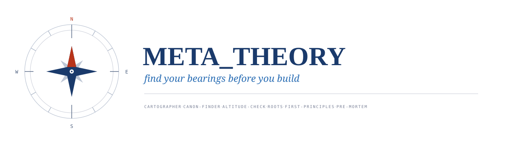

<p align="center">
  
</p>

Tools for plumbing the depths of any creative venture with long, twisted roots —
music, game-making, storytelling, and other majestic feats — *before* you find
yourself doing PhD work without the arithmetic.

Build something sophisticated enough and you eventually discover that the
universal **grammar** beneath it — the foundation every expert in the field takes
for granted — was never written down where you could see it. The gap is
predictable. This is the kit for predicting it, early, in any domain.

---

## The core insight (why this is needed at all)

The failure mode is rarely ignorance — every fact is usually available the whole
time. The failure is **sequence**: you have the *content* but never ask for the
*curriculum*. And that is a structural property of working with an AI, not a
one-off slip:

> **An LLM answers the question you ask, at the altitude you ask it.** Ask for a
> dubstep drop and you get a great drop — it will not spontaneously volunteer the
> 500-year-old theory of phrase and cadence beneath it. A human mentor *withholds*
> the advanced material until you have the scaffold; a model hands you whichever
> rung you point at.

So the leverage move, at the start of any deep venture, is almost always the
same: **ask for the map and the learning-order, not just the answer.** Everything
in this directory is a way to force that move — once, deliberately, early — and
then to re-check that you never drifted above your foundation.

Three convictions underneath the kit:

1. **Knowledge ≠ curriculum.** Knowing facts is not knowing the order to learn
   them in. The order *is* the expertise.
2. **Altitude awareness beats raw knowledge.** Knowing *which rung you're standing
   on* — and whether the rungs below it exist — prevents more failure than any
   single fact.
3. **The roots are where the majesty (and the reusable principle) lives.** Crafts
   with long histories inherited their deepest rules from older disciplines; find
   the root and the modern rule stops feeling arbitrary.

---

## What's in here

```
META_THEORY/
  README.md            ← you are here: the thesis, the order, the map
  prompts/             ← six named, copy-pasteable, subject-agnostic prompts
    01-cartographer.md       map the full ladder of mastery before building
    02-canon-finder.md       locate the tried-and-true foundation + its gates
    03-altitude-check.md     audit: are we above our foundation? (recurring)
    04-roots.md              trace the long, twisted historical lineage
    05-first-principles.md   the deepest invariants — why the techniques work
    06-pre-mortem.md         what foundational gap will bite us in 6 months?
  skills/              ← the same discipline, baked into Claude Code skills
    README.md                the skill network + relationships + diagram
    cartographer.md          /cartographer  — spec
    canon-finder.md          /canon-finder  — spec
    altitude-check.md        /altitude-check — spec (the recurring auditor)
  maestro.md           ← the vision: a repo that pays ontological house-calls
```

**Prompts** are the raw method — use them anywhere, even outside Claude Code (paste
into any chat). **Skills** wrap the highest-value prompts so the *discipline runs
itself* (and can be put on a recurring `/loop`). **Maestro** is the endgame: one
place that runs the audit across a whole portfolio of repos.

---

## The recommended order

For a *new* venture, run the **map phase** once, then build, then put the **audit
phase** on a cadence:

```
   MAP (once, up front)                 BUILD            AUDIT (recurring)
   ─────────────────────                ─────            ─────────────────
   1. cartographer   ──┐
   2. canon-finder   ──┤ these three     ……→  make the   3. altitude-check  ⟲
   5. first-principles─┤ zoom into the         actual     6. pre-mortem      ⟲
   4. roots          ──┘ map's layers          thing
```

- **Cartographer** is the spine — it produces the ladder of mastery. The other
  three map-phase tools each *zoom into one dimension* of that ladder: canon-finder
  into "what to read for the foundation," first-principles into "why it works,"
  roots into "where it came from."
- **Altitude-check** and **pre-mortem** are the same audit pointed at *now* and at
  *the future* respectively. Run them at each milestone — or hand them to
  [`maestro.md`](./maestro.md) and let them run on a schedule, forever.

If you only ever adopt one habit: **run `altitude-check` at every milestone.** It
is this whole discipline, turned into a reflex.

---

## Relationship to the skills you already have

- **`deep-research`** is the *engine* for `cartographer` and `canon-finder` — they
  are disciplined research questions; the fan-out/verify/cite harness does the
  heavy lifting.
- **`loop`** is what turns `altitude-check` from "a thing I remember to do" into "a
  thing that happens on a cadence" — the structural fix for a structural problem.
- **`maestro`** ([`maestro.md`](./maestro.md)) is `loop` + `altitude-check`
  generalized from one repo to a portfolio.

See [`skills/README.md`](./skills/README.md) for the full network.
